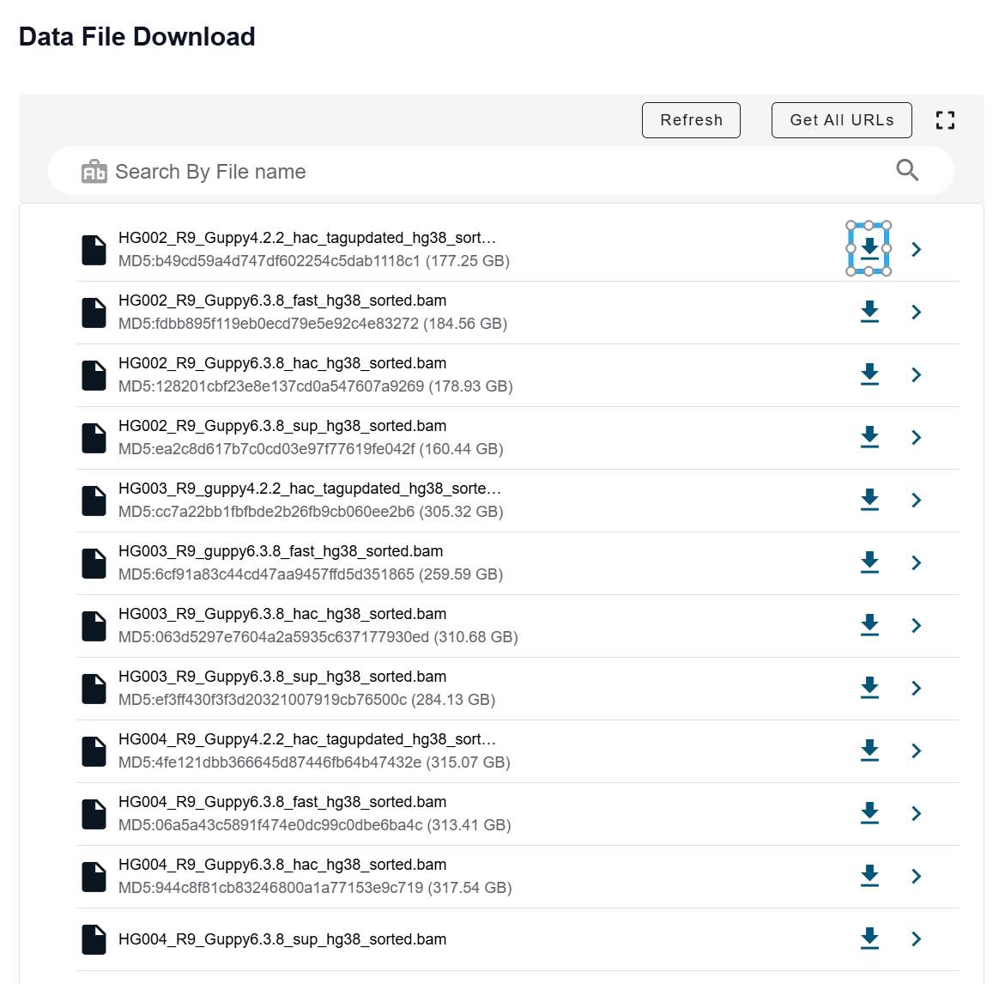
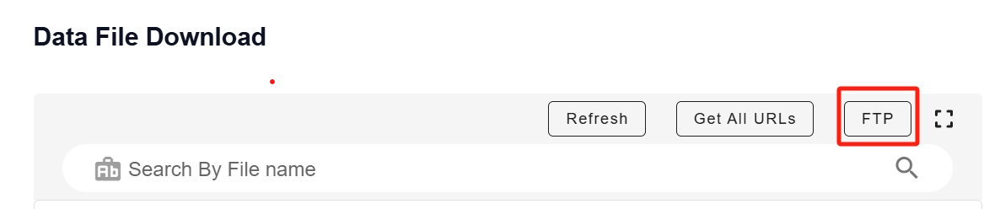

# How to download data from ScienceDB
## Introduction
Our ONT basecalled data is shared via [ScienceDB](https://www.scidb.cn/en), an open, trusted global database for data publishing. We selected ScienceDB over popular options like `Figshare` or `Zenodo` due to the large size of our data.

## Ways to download
1. Web browser

    This method allows for `anonymous` downloading, but requires a graphical user interface. Simply open the shared link in a web browser and click on the download button (blue square in the following figure) to access the data.
    


2. FTP server

   This method first requires login to `ScienceDB`. Then click the `FTP` (red square in the following figure) to retrieve FTP access info.
   

   Once you get the FTP access info, you can use following command to download the data we shared.

   <mark>Remember to swap the `${USERNAME}` and `$PASSWORD` to your FTP access info.</mark>
   ```bash
   # Download all the fastq.gz file
   lftp -u ${USERNAME},${PASSWORD} -e "mget *.fastq.gz; bye" ftp://ftp-upload.scidb.cn:2121;

   # Download a specific fastq.gz file
   lftp -u ${USERNAME},${PASSWORD} -e "get COLO829_R10D0FAST_all.fastq.gz; bye" ftp://ftp-upload.scidb.cn:2121;
   ```


## Possible problem
1. lftp
   
   If your operating system does not include `lftp`, try to install `lftp` through conda <https://anaconda.org/conda-forge/lftp> or install `apt` on Ubuntu (sudo required).
   ```bash
   # install through conda
   conda env create -n lftp;
   conda activate lftp;
   conda install conda-forge::lftp;

   # install through apt
   sudo apt install lftp;
   ```
